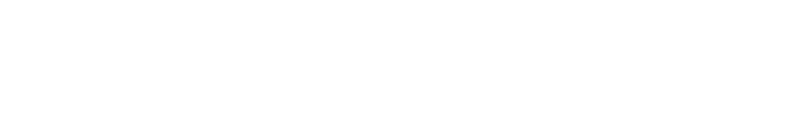

# LUT2Graph



This repository contains the code for the final project of the course "INF 791 - Redes Complexas" at the Universidade Federal de Viçosa(UFV) in the 2026/1 semesters.

The project consists of a tool that converts a Look-Up Table (LUT) into a graph representation. The LUT is a data structure used in digital logic design to represent the output of a combinational logic circuit based on its inputs.

The main goal of this project is to provide a guide to prune the complete circuit graph using all thechniques learned in the course. The resulting graph can be used for various applications, such as circuit analysis, optimization, and visualization.

## Installation

## Usage

## Theoretical Background

### LUT 

### Graph Representation

### Main Concepts

## Repository Structure

```
.
├── misc
│   ├── data
│   └── examples
│       └── lib
│           ├── bindings
│           ├── tom-select
│           └── vis-9.1.2
├── results
│   ├── example_graph
│   │   └── vis
│   └── result
│       └── vis
├── src
└── test
```
