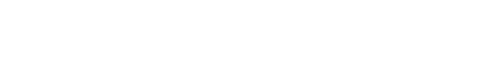

# LUT2Graph



This repository contains the code for the final project of the course **INF 791 - Redes Complexas** at the Universidade Federal de Viçosa (UFV) in the 2026/1 semester.

The project consists of a tool that converts a Look-Up Table (LUT) netlist — produced by the [Yosys](https://yosyshq.net/yosys/) synthesis tool — into an annotated directed graph representation. Each LUT cell becomes a node, each inter-cell connection becomes a weighted edge, and primary I/O ports are registered as boundary nodes. The resulting graph is then analysed using complex-network metrics to guide pruning and optimisation of the circuit.

On top of the same graph builder, the tool also **pipelines the circuit with ASAP/ALAP retiming**: the LUT graph is levelized, split into stages, and register ranks are inserted at the stage boundaries. The pipelined circuit is exported back to Yosys JSON and Verilog and checked for functional equivalence against the original netlist.

> **Author:** Olavo Alves Barros Silva — [olavo.barros@ufv.br](mailto:olavo.barros@ufv.br)

---

## Table of Contents

- [Installation](#installation)
- [Usage](#usage)
  - [Graph Analysis](#graph-analysis)
  - [Pruning Benchmark](#pruning-benchmark)
  - [Retiming (ASAP/ALAP Pipelining)](#retiming-asapalap-pipelining)
  - [Visualisation](#visualisation)
  - [Tests](#tests)
- [Theoretical Background](#theoretical-background)
  - [LUT](#lut)
  - [Graph Representation](#graph-representation)
  - [Main Concepts](#main-concepts)
  - [Retiming and Pipelining](#retiming-and-pipelining)
- [Repository Structure](#repository-structure)
- [Results](#results)
- [License](#license)

---

## Installation

**Requirements:** Python ≥ 3.10 and, optionally, [Graphviz](https://graphviz.org/) to render `.dot` files.

### 1. Clone the repository

```bash
git clone https://github.com/<your-username>/lut2graph.git
cd lut2graph
```

### 2. Create the virtual environment and install dependencies

```bash
python -m venv .venv
./install.sh            # installs requirements.txt inside .venv (use --upgrade to also upgrade pip)
./activate.sh           # opens a shell with the environment activated
```

Or manually:

```bash
source .venv/bin/activate      # Linux / macOS
.venv\Scripts\activate         # Windows
pip install -r requirements.txt
```

Core dependencies:

| Package | Purpose |
|---|---|
| `networkx` | Graph construction, analysis and topological scheduling |
| `numpy` | Numerical statistics |
| `matplotlib` / `seaborn` | Static plots |
| `pyvis` | Interactive HTML visualisation (optional) |
| `pytest` | Unit tests |

### 3. Install Yosys (for synthesis)

If you need to synthesise your own designs into JSON netlists, install [Yosys](https://yosyshq.net/yosys/download.html).
Pre-synthesised netlists are provided in `misc/data/` and small hand-made examples in `misc/examples/`.

---

## Usage

All scripts are run from the repository root.

### Graph Analysis

`src/main.py` builds the graph, prints the basic statistics and the critical path, and writes the netlist as a DOT file. The netlist and the run name are set by the constants at the top of the file:

```python
NETLIST = "./misc/examples/branch_join_moc.json"
TEST_NAME = "rato"
```

```bash
python src/main.py
```

Outputs go to `results/<TEST_NAME>_<ddMMyy_HHMM>/graph_original.dot`.

### Python API

```python
from lut2networkx import LUTGraphBuilder

builder = LUTGraphBuilder("misc/data/paviaU_.json", results_path="results/paviaU_")
G = builder.build()

print(G.number_of_nodes(), G.number_of_edges())
```

### Pruning Benchmark

`src/benchmark_complex_net.py` applies one pruning strategy, re-simulates the circuit on a test set and reports the accuracy and the network metrics before/after pruning.

```bash
python src/benchmark_complex_net.py <netlist.json> --prune --method <method> [options] \
    --test-data X_test.mem --test-labels y_test.mem
```

| Argument | Description |
|---|---|
| `netlist` | Path to a Yosys `*.json` netlist |
| `--test-name NAME` | Run name used for the results folder |
| `--prune` | Apply pruning |
| `--method` | `baseline`, `kcore`, `centrality`, `backbone`, `depth` or `entropy` |
| `--sens-threshold` | Edge sensitivity threshold (`baseline`, `backbone`) |
| `--bias-lower` / `--bias-upper` | Boolean Bias bounds (`baseline`) |
| `--max-shell` | Maximum shell removed (`kcore`) |
| `--centrality-metric` | `pagerank`, `eigenvector` or `degree` (`centrality`) |
| `--drop-fraction` | Fraction of LUTs removed (`centrality`, `depth`, `entropy`) |
| `--test-data` / `--test-labels` | `.mem` files used to measure the accuracy |

`./benchmark.sh` runs the six strategies on the PaviaU dataset in sequence.

### Retiming (ASAP/ALAP Pipelining)

```bash
python src/retime.py <netlist.json> (--levels-per-stage X | --stages N) [options]
```

| Argument | Description |
|---|---|
| `netlist` | Path to a Yosys `*.json` netlist |
| `--levels-per-stage X` | Insert a register rank every `X` LUT levels |
| `--stages N` | Split the critical depth into `N` balanced stages |
| `--policy` | `asap` (default) or `alap` — which level each LUT is placed at |
| `--name NAME` | Run name (default: netlist file stem) |
| `--results-path DIR` | Output directory (default: `results/`) |
| `--verify-vectors K` | Random vectors for the equivalence check (default: `200`, `0` disables) |
| `--dot` | Also write a staged DOT graph |

`--levels-per-stage` and `--stages` are mutually exclusive, and one of them is required.

**Examples:**

```bash
# a register rank every 2 LUT levels, ASAP placement
python src/retime.py misc/data/paviaU_.json --levels-per-stage 2 --policy asap

# split the critical depth into 3 balanced stages, ALAP placement, with a staged DOT graph
python src/retime.py misc/examples/medium_mix_moc.json --stages 3 --policy alap --dot
```

Each run creates `results/<name>_<policy>_<ddMMyy_HHMM>/` with:

| File | Content |
|---|---|
| `<name>_retimed.json` | Pipelined Yosys JSON netlist, with `$dff` cells and a new `clk` port |
| `<name>_retimed.v` | Structural Verilog of the pipelined netlist |
| `retime_report.json` | Depth, stages, latency, LUTs and combinational depth per stage, mobility and flip-flop count |
| `<name>_staged.dot` | Staged graph (only with `--dot`) |

The pipelined netlist is simulated cycle by cycle against the original netlist on `--verify-vectors` random input vectors; the run fails if any output differs after `latency` cycles.

### Visualisation

`src/visualize.py` writes plain Graphviz DOT, so the only external tool needed is Graphviz:

```bash
dot -Tsvg results/<run>/<name>_staged.dot -o staged.svg
```

LUTs are drawn as rounded boxes, I/O ports as circles, one column per LUT level, one dashed red cluster per pipeline stage, and the inserted flip-flops as small grey boxes on the cuts between stages.

### Tests

```bash
pytest test/
```

`test/test_retime.py` checks the ASAP/ALAP levels, the level-to-stage mapping, the flip-flop count on a small example and the functional equivalence of the pipelined PaviaU netlist for both policies and several stage cuts.

---

## Theoretical Background

### LUT

A **Look-Up Table (LUT)** is the fundamental building block of Field-Programmable Gate Arrays (FPGAs). A $k$-input LUT stores a truth table of $2^k$ binary values and can implement any Boolean function of up to $k$ variables. Modern synthesis tools (such as Yosys + ABC) map arbitrary combinational logic to networks of LUTs during technology mapping.

In the Yosys JSON format, each LUT cell is represented by:
- a `LUT` parameter — a binary string of length $2^k$ encoding the truth table;
- an `A` connection — a list of $k$ input signal identifiers;
- a `Y` connection — the output signal identifier.

### Graph Representation

The netlist is modelled as a **directed graph** $G = (V, E)$ where:

- **Nodes $V$** represent signals:
  - `input` — primary input ports.
  - `output` — primary output ports.
  - `$lut` — internal LUT cells, annotated with their *Boolean Bias*.

- **Edges $E$** represent data-flow dependencies from a driver signal to a driven LUT input, annotated with their *Boolean Sensitivity*.

This formulation preserves the combinational depth (critical path), fan-in/fan-out structure, and the functional character of each gate — going beyond a purely structural graph.

### Main Concepts

#### Boolean Bias

The **Boolean Bias** of a LUT is the fraction of output bits that equal `1` in its truth table:

$$\beta = \frac{|\{i : \text{LUT}[i] = 1\}|}{2^k}$$

A bias near $0$ or $1$ indicates highly predictable, potentially redundant logic. A bias near $0.5$ indicates balanced logic. Bias is stored as a node attribute and drives node-level analysis.

#### Boolean Sensitivity

The **Boolean Sensitivity** (or *influence*) of input $j$ of a LUT measures the probability that flipping bit $j$ of a uniformly random input vector also flips the output:

$$\sigma_j = \frac{1}{2^{k-1}} \sum_{\substack{x \in \{0,1\}^k \\ x_j = 0}} \mathbf{1}[\text{LUT}(x) \neq \text{LUT}(x \oplus e_j)]$$

where $e_j$ is the unit vector with a $1$ in position $j$. High sensitivity means the edge carries more functional weight. Sensitivity is stored as the `weight` attribute on each edge.

#### Complex-Network Metrics

| Metric | Description |
|---|---|
| **Degree distribution** | In- and out-degree histograms, per node type |
| **Density** | Fraction of possible edges that are present |
| **Weakly / Strongly Connected Components** | Number and size of WCC/SCC |
| **Is DAG** | Whether the graph is a directed acyclic graph (always true for combinational circuits) |
| **Global Clustering Coefficient** | Average local clustering over the undirected projection |
| **Average Path Length** | Mean shortest path in the Largest Connected Component |
| **Neighbourhood Overlap (Jaccard)** | Mean Jaccard coefficient over all edges — measures local redundancy |
| **Critical path** | Longest LUT chain from an input to an output |
| **Boolean Bias statistics** | Mean, std, min, max of $\beta$ across all LUT nodes |
| **Edge Weight statistics** | Mean, std, min, max of $\sigma_j$ across all edges |

These metrics guide the pruning strategy: edges with low sensitivity and nodes with extreme bias are natural candidates for removal without significant functional loss.

### Retiming and Pipelining

In a synchronous circuit the clock period is limited by the slowest purely combinational path between two registers (the *critical path*). **Retiming** (Leiserson & Saxe, 1991) moves registers across logic cells without changing the input/output behaviour, so that long paths are cut and path lengths are balanced. **Pipelining** is the particular case used here: the Yosys LUT netlist is purely combinational, so $S-1$ register ranks are *added* and placed so that every stage has roughly the same LUT depth. The function is preserved; the outputs simply appear $S-1$ cycles later.

#### Circuit view

Each LUT counts as one unit of delay (routing is ignored). A path with $D$ chained LUTs costs $D \cdot t_{\text{LUT}}$, so $f_{\max} \approx 1 / (D\, t_{\text{LUT}})$. Inserting a register rank every $x$ LUT levels limits each stage to at most $x$ LUTs:

$$f_{\max} \approx \frac{1}{x\, t_{\text{LUT}}}, \qquad \text{latency} = \left\lceil \frac{D}{x} \right\rceil - 1 \text{ cycles}$$

To stay correct, **every** input-to-output path must cross the same number of registers; otherwise, signals from different clock cycles would be mixed.

#### Graph view

Retiming is expressed by edge weights $w(u,v)$ — the number of registers on the edge — and a label $s(v)$ per node, the **pipeline stage** of $v$:

$$w_s(u,v) = w(u,v) + s(v) - s(u), \qquad w(u,v) = 0 \text{ initially}, \qquad w_s(u,v) \geq 0$$

Since $s$ is non-decreasing along the edges, no weight becomes negative (valid retiming), and the sum of the weights along any input → output path telescopes to $s(\text{output}) - s(\text{input}) = S - 1$, i.e., all paths have the same latency.

#### ASAP, ALAP and mobility

Levels count LUTs only:

- **ASAP** — in topological order, inputs get level $0$ and each LUT gets $1 + \max$ of its predecessors' levels. The circuit depth $D$ is the largest ASAP level.
- **ALAP** — in reverse topological order, each LUT gets $\min$ of its successors' levels $-1$ (outputs sit at $D+1$).
- **Mobility** — $\text{ALAP} - \text{ASAP}$ is the slack of a LUT; LUTs on the critical path have mobility $0$.

#### Algorithm (`src/retime.py`)

1. **Levelization:** compute the ASAP and ALAP levels of every node.
2. **Stages:** group the levels every $x$ levels (`--levels-per-stage`) or into $S$ balanced ranges (`--stages`). Each LUT takes the stage of its ASAP or ALAP level (`--policy`). Inputs stay in stage $0$ and outputs are forced into the last stage.
3. **Register insertion:** an edge $(u,v)$ receives $s(v) - s(u)$ flip-flops. Registers on the same net are shared as a single shift-register chain, so a net with fan-out only pays for its farthest consumer.
4. **Export and verification:** the netlist is rewritten as Yosys JSON/Verilog with `$dff` cells and a `clk` port, then simulated cycle by cycle against the original netlist on random vectors.

The policy changes where the registers end up: ASAP pulls LUTs with slack towards the inputs, ALAP pushes them towards the outputs. Which one needs fewer flip-flops depends on whether the slack sits on narrow or wide parts of the circuit.

---

## Repository Structure

```
.
├── misc
│   ├── data                   # Pre-synthesised Yosys JSON netlists (e.g. paviaU_.json)
│   ├── doc
│   │   ├── assignments        # Course assignments (TP1 and final project)
│   │   ├── imgs               # Documentation images (logo)
│   │   └── retiming           # Internal note on retiming/pipelining (LaTeX + PDF)
│   └── examples               # Small hand-made netlists and the example notebook
├── results                    # Run outputs (<name>_<policy>_<ddMMyy_HHMM>/, viz_preview/)
├── src
│   ├── lut2networkx.py        # LUTGraphBuilder class
│   ├── graph_metrics.py       # Complex-network metrics, report and plots
│   ├── main.py                # Graph analysis entry-point
│   ├── pruner.py              # Pruning strategies
│   ├── evaluator.py           # Graph-level circuit simulator (accuracy after pruning)
│   ├── benchmark_complex_net.py  # Pruning benchmark CLI
│   ├── retime.py              # ASAP/ALAP levelization and pipelining CLI
│   ├── netlist_export.py      # Register insertion in the Yosys JSON + Verilog writer
│   ├── netlist_sim.py         # Cycle-accurate netlist simulator and equivalence check
│   └── visualize.py           # Graphviz DOT writer (plain and staged graphs)
├── test
│   ├── context.py             # Adds src/ to sys.path
│   └── test_retime.py         # Retiming unit tests
├── benchmark.sh               # Pruning benchmark suite (PaviaU)
├── install.sh                 # Installs the dependencies in .venv
└── activate.sh                # Activates .venv
```

### Key source files

| File | Role |
|---|---|
| `src/lut2networkx.py` | `LUTGraphBuilder` — parses the Yosys JSON, registers nodes/edges with Boolean Bias and Sensitivity annotations, and exposes the `networkx.DiGraph` |
| `src/graph_metrics.py` | Computes the complex-network metrics and the critical path, prints the report and saves the plots |
| `src/pruner.py` | Hardware-aware, k-core, centrality, backbone, depth-aware and entropy-aware pruning |
| `src/retime.py` | `compute_asap`, `compute_alap`, `level_to_stage`, `schedule_graph` and `summarize` — the retiming pipeline and its CLI |
| `src/netlist_export.py` | `pipeline_netlist` — inserts the shared `$dff` chains in the Yosys JSON; `write_verilog` — structural Verilog export |
| `src/netlist_sim.py` | `NetlistSimulator` and `verify_pipeline` — cycle-accurate equivalence check between the original and the pipelined netlists |
| `src/visualize.py` | `write_dot` — DOT export of the plain or staged graph |

---

## Results

### Retiming

Pipelining of `misc/examples/medium_mix_moc.json` (depth $D = 6$) into 3 stages:

| Policy | LUTs per stage | Max comb. depth | Latency | Flip-flops |
|---|---|---|---|---|
| ASAP | 11 / 5 / 3 | 2 | 2 cycles | 24 |
| ALAP | 2 / 5 / 12 | 2 | 2 cycles | 28 |


Pipelining of `misc/data/paviaU_.json` (1022 LUTs, depth $D = 12$, 129 LUTs with mobility, max mobility 4) with the ASAP policy:

| Cut | Stages | LUTs per stage | Max comb. depth | Latency | Flip-flops |
|---|---|---|---|---|---|
| every 2 levels | 6 | 288 / 257 / 186 / 238 / 47 / 6 | 2 | 5 cycles | 533 |
| every 4 levels | 3 | 545 / 424 / 53 | 4 | 2 cycles | 259 |

Halving the combinational depth per stage (from 4 to 2 LUTs) roughly doubles the achievable clock frequency, at the cost of about twice the flip-flops and 3 more cycles of latency. All runs passed the equivalence check.

### Graph analysis and pruning

Previous analysis and pruning results are archived in `results/old_results_160926.zip`.

---

## License

MIT License — see `LICENCE` for details.
